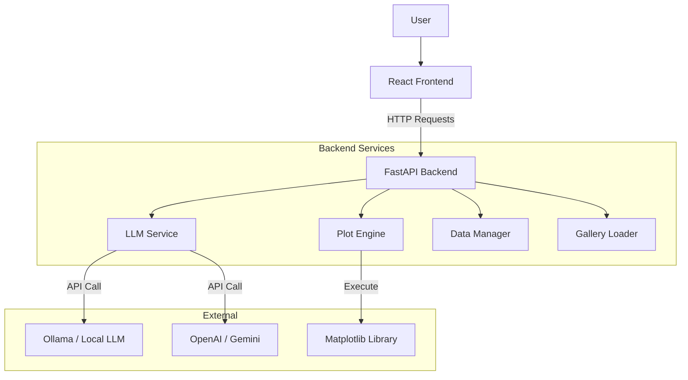
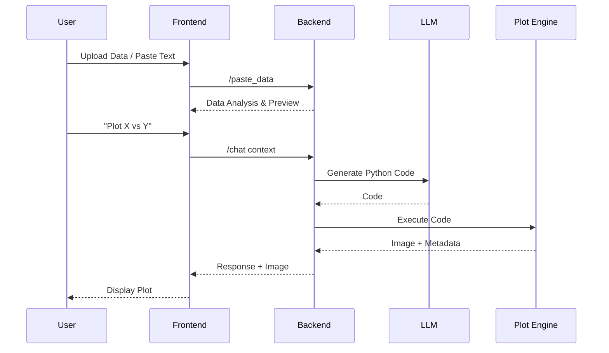

# System Architecture

## Overview

The Plot MCP system consists of a Python FastAPI backend and a React frontend. The backend handles data processing, LLM interaction, and plot generation, while the frontend provides the user interface.

## System Diagram

## Component Details

### 1. Data Manager
Handles file uploads and parsing. It intelligently detects format delimiters (CSV, TSV, space) and creates a Pandas DataFrame. It generates data summaries for the LLM.

### 2. LLM Service
Constructs prompts for the Large Language Model. It injects data context, conversation history, and instructions. It parses the LLM response to extract executable Python code.

### 3. Plot Engine
safe execution environment for generated Python code. It applies publication-quality styles (fonts, formatting) and renders the plot to an image buffer. It also extracts interaction metadata (bounding boxes for titles/labels).

### 4. Frontend
A React application that manages state (chat history, data). It renders the plot image and handles interactive clicks by mapping coordinates to the metadata provided by the Plot Engine.

## Data Flow

