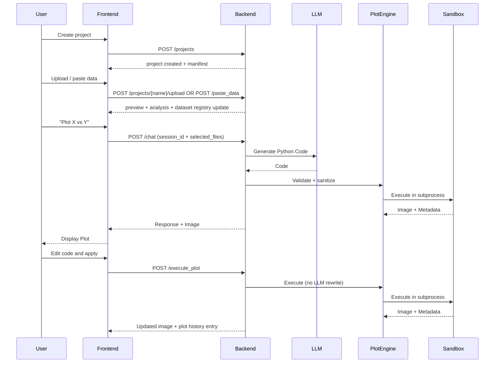

# System Architecture

## Overview

Plot MCP consists of:

- A **FastAPI backend** (`backend/main.py`) for projects, sessions, data workflow, LLM orchestration, and safe plot execution.
- A **React + Vite frontend** (`frontend/`) focused on a plot-first workflow with a chat sidebar and tool drawer.
- An optional **standalone MCP server** (`mcp_server.py`) that exposes plotting tools to any MCP-capable LLM client.

## System Diagram

```mermaid
graph TD
    User[User] --> Frontend[React Frontend (Vite)]
    Frontend -->|HTTP| Backend[FastAPI Backend]
    
    MCPClient[MCP Client (Claude Desktop, etc.)] -->|stdio| MCPServer[mcp_server.py]
    MCPServer --> Plot
    MCPServer --> LLM

    subgraph Backend Services
        Backend --> Projects[ProjectManager + project.json]
        Backend --> Sessions[SessionManager]
        Backend --> Data[DataManager + Validator]
        Backend --> Join[JoinAssistant]
        Backend --> Gallery[Gallery KB + Adapters]
        Backend --> LLM[LLMService]
        Backend --> Plot[PlotEngine]
        Plot --> Sandbox[SandboxExecutor + sandbox_runner.py]
        Backend --> Assets[PlotStorage (images + thumbnails)]
        Backend --> Metrics[/metrics]
    end

    subgraph External
        LLM -->|HTTP| Ollama[Ollama / Local LLM]
        LLM -->|HTTP| Cloud[OpenAI / Gemini]
        Sandbox -->|render| Matplotlib[Matplotlib (Agg)]
    end
```

## Component Details

### 1. Project + Manifest

- **`backend/project_manager.py`**: creates and lists per-project folders (default `backend/projects`, configurable via `PROJECTS_DIR`).
- **`backend/project_manifest.py`**: maintains a `project.json` manifest per project:
  - dataset registry (paths + inferred schema + hashes)
  - plot history (image + thumbnail paths + code + description)
  - UI state (selected files, last plot index)

### 2. Sessions (Threaded Chat)

- **`backend/session_manager.py`**: stores sessions and message history as JSON on disk (`backend/sessions` by default).
- Sessions are auto-titled from the first user message for human-readable thread names.

### 3. Data Workflow

- **`backend/data_manager.py`**: file uploads, pasted data ingestion, previews, and context strings for LLM prompting.
- **`backend/data_validator.py`**: infers column types, warns about issues, and suggests plot types.
- **`backend/join_assistant.py`**: provides join/merge suggestions for multi-file plotting.

### 4. LLM Service

- **`backend/llm_service.py`**: provider adapters (Ollama/OpenAI/Gemini), structured prompts, clarification logic, and logging.
- The backend can also produce deterministic template plots for common data-free requests (e.g., waves).

### 5. Plot Engine + Sandbox

- **`backend/plot_engine.py`**: validates code (`backend/code_safety.py`), strips imports, then runs in a sandboxed subprocess.
- **`backend/sandbox_executor.py`**: launches `backend/sandbox_runner.py` with timeouts and optional memory caps.
- **`backend/sandbox_runner.py`**: executes plot code with a restricted builtin set, pre-injected `plt/pd/np/sns`, then saves an image.

### 6. Frontend

- Left sidebar: projects, file selection, sessions, chat.
- Main area: plot canvas with plot history (thumbnails) and a code editor.
- Tools drawer: Preview / Join / Analysis / Gallery.

## Data Flow


