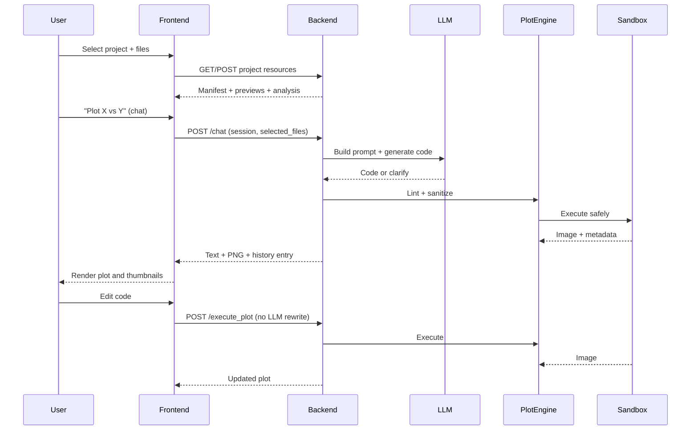

# System Architecture

This page shows how the pieces fit together and how data moves through the system.

## High-Level Map

- **Frontend (React + Vite)**: projects, sessions, file picker, chat, plot canvas, thumbnails, code editor.
- **Backend (FastAPI)**: projects, sessions, data prep, joins, LLM orchestration, sandboxed plot execution, metrics.
- **Standalone MCP server**: `mcp_server.py` exposes tools to any MCP-capable client (Claude Desktop, etc.).

## Component Diagram

```mermaid
graph TD
    User[User] --> Frontend[React Frontend (Vite)]
    Frontend -->|HTTP| Backend[FastAPI Backend]

    MCPClient[MCP Client] -->|stdio/HTTP| MCPServer[mcp_server.py]
    MCPServer --> Plot
    MCPServer --> LLM

    subgraph Backend Services
        Backend --> Projects[ProjectManager + project.json]
        Backend --> Sessions[SessionManager]
        Backend --> Data[DataManager + Validator]
        Backend --> Join[JoinAssistant]
        Backend --> Gallery[Gallery RAG]
        Backend --> LLM[LLMService]
        Backend --> Plot[PlotEngine]
        Plot --> Sandbox[SandboxExecutor + sandbox_runner.py]
        Backend --> Assets[Images + Thumbnails]
        Backend --> Metrics[/metrics]
    end

    subgraph External
        LLM -->|HTTP| Ollama[Ollama / Local]
        LLM -->|HTTP| Cloud[OpenAI / Gemini]
        Sandbox -->|render| Matplotlib[Matplotlib (Agg)]
    end
```

## Backend Responsibilities (one glance)

- **Projects**: per-project folders + `project.json` manifest (datasets, hashes, plot history, UI state).
- **Sessions**: JSON history on disk, auto-titles from first user message for readable threads.
- **Data**: uploads/paste, preview, schema inference, warnings, suggested plots, join assistant hints.
- **LLM**: provider adapters (Ollama/OpenAI/Gemini), structured prompts, clarify step, optional gallery RAG.
- **Plot Engine**: AST lint, import stripping, alias map for multi-file, sandboxed execution with timeouts/memory caps.
- **Metrics/Logging**: `/metrics` and `backend/logs/llm.log`.

## Frontend Layout

- Sidebar: projects, file selection, sessions, chat context.
- Main pane: plot canvas + thumbnails; code editor for apply/redo.
- Tools drawer: Preview, Join/merge assistant, Analysis, Gallery suggestions.

## Data Journey (concise)



## Ports and Defaults

- Backend: `http://0.0.0.0:8000`
- Frontend (Vite): `http://localhost:5173`
- MCP server: stdio by default; HTTP transport defaults to `127.0.0.1:8765`

## Safety Rails

- No try/except in core logic; validation + explicit error propagation.
- AST lint blocks disallowed imports/calls and ellipsis placeholders.
- Sandbox runner: restricted builtins, injected `plt/pd/np/sns`, resource limits, Agg renderer.
- Optional memory cap via `PLOT_EXEC_MEMORY_MB`; optional enforced styling via `PLOT_ENFORCE_STYLE=1`.
